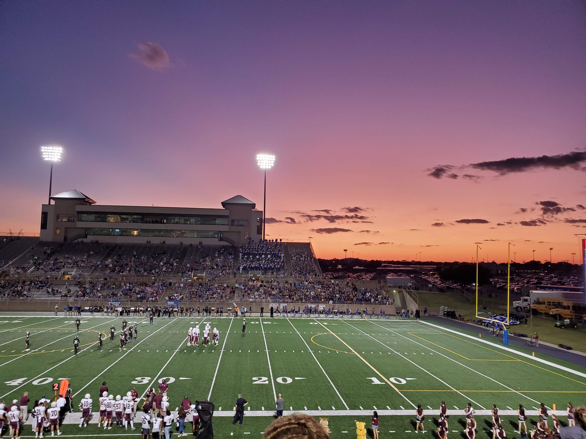

This picture shown above is by no means the best picture ever taken. You can see the top of someone's head creep into the bottom of the frame, and if you stare long enough, you can see that the picture is tilted in the horizontal direction. However, this is still probably my favorite picture that I have taken because it captures the full essence of one of my favorite times in my life: Friday Night Lights.

I was a part of the marching band in high school, which meant that I went to every single high school football game, and being from the North Texas area, where high school football is, for better or for worse, of utmost importance as far as the schools are concerned, this was brought many unique experiences. Whether it be the absurd stadiums of Allen High School and Prosper High School, or breaking the news with our game against an El Paso school just weeks after the horrific El Paso shooting, it seemed like each week brought a new experience.

This picture in particular came from on of the most anticipated games every year: our game against our rival school, Plano West, also known as Wuck Fest (switch the W and the F to understand why its called that 😉).

