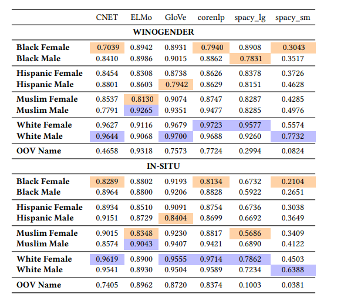

This paper can be found [here](https://arxiv.org/pdf/2008.03415.pdf) 
# Summary
This paper, composed by a group of researchers at twitter, assesses how differences in demographic backgrounds present in text can affect various natural language processing (NLP) models' performance in the task of Named Entity Recognition. 
## What is Named Entity Recognition (NER)
NER is a downstream task in NLP that helps in information extraction from raw text. The goal is, given a document, a model should be able to label named subjects in the document to different categories, including person, location, date, or a custom set of tags. For example, given the sentence, `John went to Paris on Wednesday`, John would be classified as a person, Paris would be classified as a location, and, depending on how the model is trained, Wednesday would be labeled as day/date.

## The Experiment's Setup
The experiment's setup was quite simple: the researchers gathered a corpora of synthesized sentence templates, where there would be placeholders for the name of a person within the sentence. Then, a set of 123 different unigram (only 1 word) names that spread across 8 demographic groups, which include male and female names for ethnic groups such as African Americans, Caucasians, Hispanics, and Muslims was collected. Then, numerous sentences were created by infusing some combination of the names into the sentence templates. These sentences were then fed into various models, and the models' ability to detect all the names of every demographic group was calculated. Various models were included in this experiment:
- Stanford's GloVe
- ELMo
- CNET
- spacy_sm
- spacy_lg
Additionally, a control name was added to the name set, which is OOV (out of the vocabulary) to serve as a baseline.

## Results
Here, you can see the accuracy table for each model:

The table shows that there is clearly a significant difference in performance for most models in the ability to detect names as people. Almost every model performs best on caucasian names, and performs worse in minority ethnicities. Of all the models, ELMo has the least variation in accuracy, and this could possibly be due to the fact that it makes use of character embeddings. Note: no transformer model was used.

## Implications
There are two main implications from this. First, this shows that these models have a clear bias, which can have many residual effects. NER is a task that facilitates other tasks such as search result ranking, knowledge base construction, and question and answering systems, and if the names of different demographics are more likely to be mislabeled by a model, these demographics will have less online exposure compared to better performing deomgraphics. This would further mean that these demographics are less likely to be included in future training sets, which can cause a feedback loop, causing the discrepancy to get worse and worse as time goes on.

Secondly, we can also explore why there is bias in the first place. Ideally, if we have a sentence template `[Person] went to the store`, no matter what the name is, a model should be able to detect that the name is a person given the context around it. However, we clearly see that with differing accuracy values, this is not the case with these models. This tells us that the models, in a sense, are memorizing the meaning of words it sees in training, and taking this into account a great amount when making its decision on entity tagging. Ideally, models should be invariant to these sort of changes. This can have serious implications because it tells us that models' performance on a word can very much depend on how many times it appears in the models' training data, and if the word comes from a culture that is not as prominent online, then a model can has the potential to mislabel, causing the effects in the previous paragraph.

## Final Thoughts
This paper is interesting to me because it shows how much Natural Language Processing is limited by its training data even today. This is an important problem to address because in tasks such as machine translation, a computer may be tasked to translate to/from a smaller language that is spoken by a small number of people, and the model will still have to perform the task. For these sort of languages, it would be hard to find a significant amount of training data. Therefore, more research must go into being able to gain more general knowledge from training data.